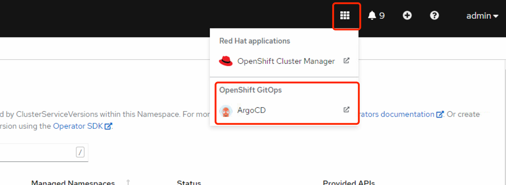
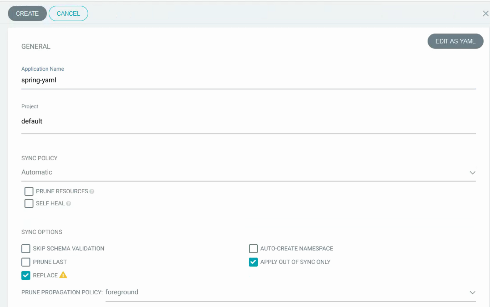
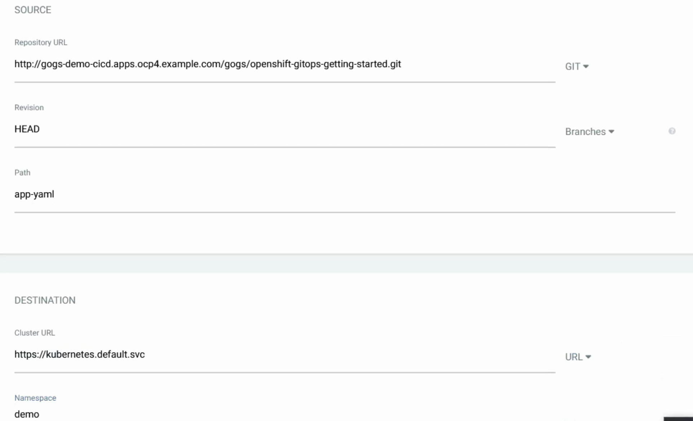
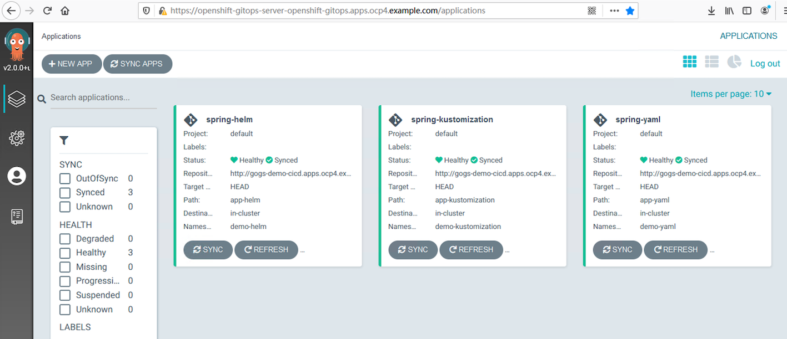
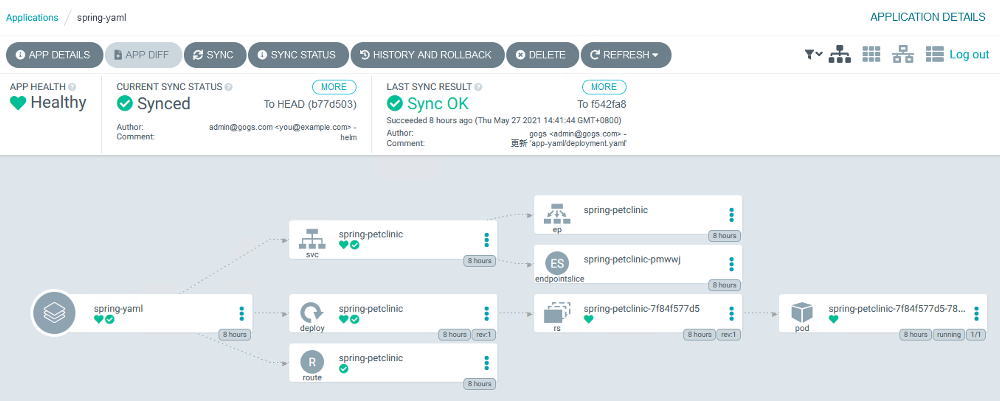
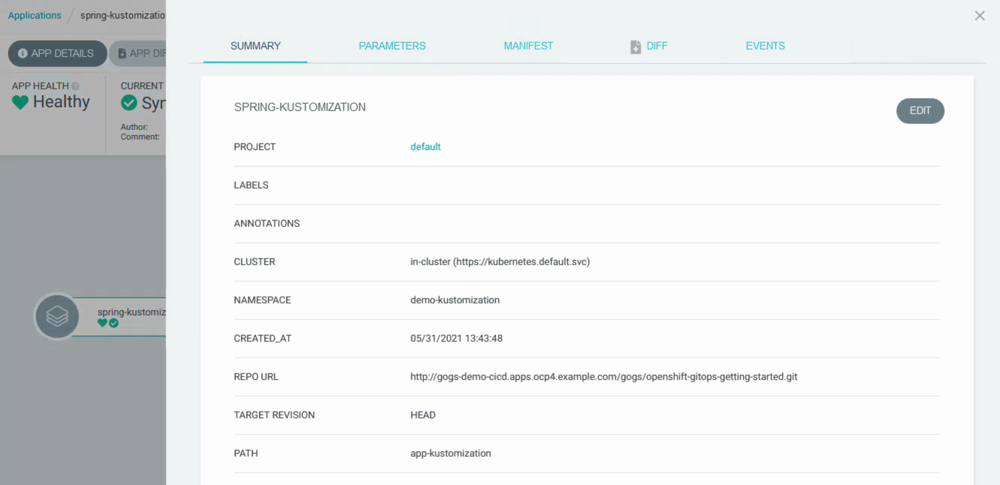
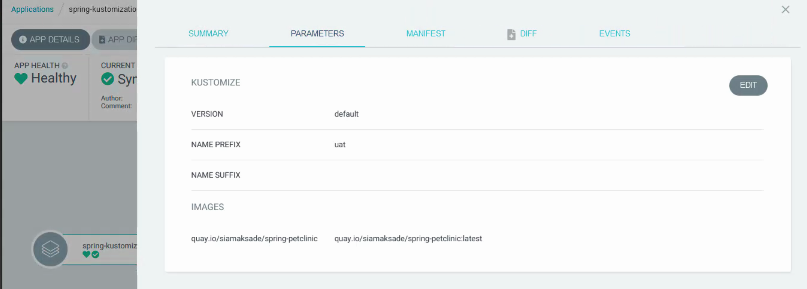
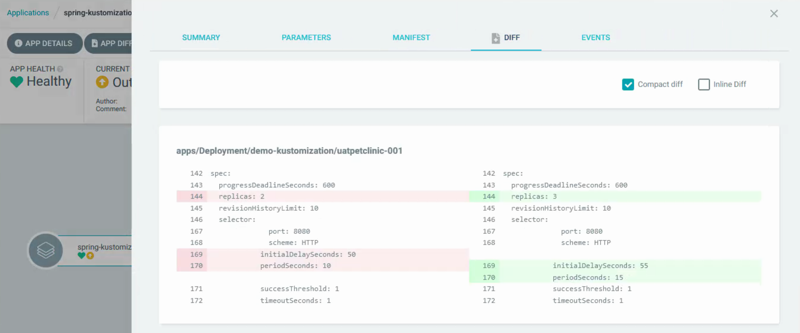
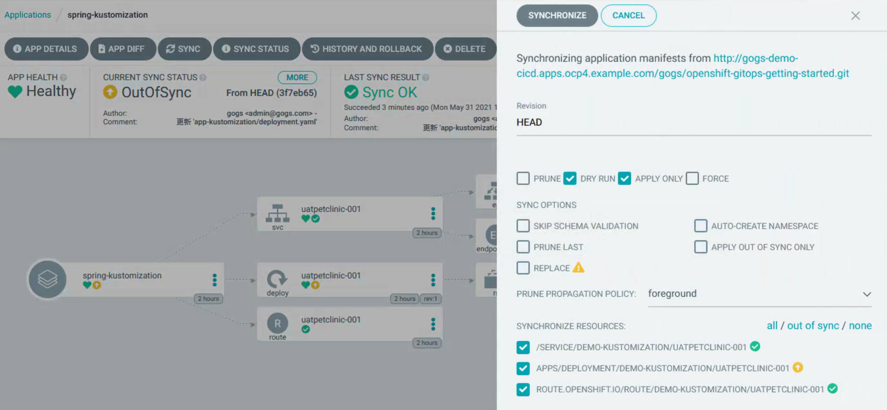

### Install Openshift GitOps Operator 
在 Web 控制台中安装 GitOps Operator
先决条件： 以管理员身份登录 OpenShift 集群。

打开 Web 控制台的 Administrator 视角，并进入左侧菜单中的 Operators → OperatorHub。
搜索 OpenShift GitOps，点 Red Hat OpenShift GitOps 标题，然后点 Install 按钮。
注意不是community的那个argocd  

Red Hat OpenShift GitOps 将安装在集群的所有命名空间中。

在 Installed Operators 中看到状态为 Succeeded 即完成。  

Red Hat OpenShift GitOps Operator 会自动创建一个可用的 Argo CD 实例，可在 openshift-gitops namespace中使用。

使用 Red Hat OpenShift GitOps，可以通过 Argo CD 将 Git 目录的内容与包含集群自定义配置的应用程序同步到openshift。

```bash
[root@bastion pipeline]# oc get pod -n openshift-gitops 
NAME                                                          READY   STATUS    RESTARTS   AGE
cluster-b5798d6f9-6pmmb                                       1/1     Running   0          5m1s
kam-69866d7c48-pvzb6                                          1/1     Running   0          4m59s
openshift-gitops-application-controller-0                     1/1     Running   0          4m59s
openshift-gitops-applicationset-controller-6447b8dfdd-28845   1/1     Running   0          4m59s
openshift-gitops-redis-74bd8d7d96-rpbdg                       1/1     Running   0          4m59s
openshift-gitops-repo-server-c999f75d5-pbg9m                  1/1     Running   0          4m59s
openshift-gitops-server-6ff4fbc8f6-czd4l                      1/1     Running   0          4m59s
[root@bastion pipeline]# oc get route -n openshift-gitops 
NAME                      HOST/PORT                                                        PATH   SERVICES                  PORT    TERMINATION            WILDCARD
cluster                   cluster-openshift-gitops.apps.ocp4.example.com                          cluster                   8080    reencrypt/Allow        None
kam                       kam-openshift-gitops.apps.ocp4.example.com                              kam                       8443    passthrough/None       None
openshift-gitops-server   openshift-gitops-server-openshift-gitops.apps.ocp4.example.com          openshift-gitops-server   https   passthrough/Redirect   None
```

openshift-gitops-server-openshift-gitops.apps.ocp4.example.com
这个就是 argocd 控制台，通过route 访问或者页面上点击快捷链接


用户名 admin  

获取 Argo CD 登录密码的方法1  
导航到 web 控制台的 Developer 视角。
导航到 openshift-gitops 项目。
使用左侧导航面板导航到 Secrets 页面。
选择 openshift-gitops-cluster 实例来显示密码。
复制密码。
使用此密码和 admin 作为用户名在新窗口中登录到 Argo CD UI。

获取密码方法2
```bash
[root@bastion pipeline]# oc extract secret/openshift-gitops-cluster -n openshift-gitops --to=-
# admin.password
5ERxXZwsbK8ihanHfW9UdSAyjGDg0lY4

```

### 创建demo应用程序

创建 project 并给 argocd 授权，以便能够创建应用，直接给了 cluster-admin，不用后面去一个个 project 授权。

```bash
oc new-project demo-yaml
oc adm policy add-cluster-role-to-user cluster-admin system:serviceaccount:openshift-gitops:openshift-gitops-argocd-application-controller  
oc adm policy add-cluster-role-to-user cluster-admin system:serviceaccount:openshift-gitops:openshift-gitops-argocd-server

```

在 Argo CD 仪表板中，点 New App 按钮添加新的 Argo CD 应用程序。

通过页面键入的参数，其实是生成了一个 argocd 的CRD，kind: Applications

General:
  Name: spring-yaml  #自定义
  Project: default  #不要改
  SyncPolicy : Manual   #同步策略，手动或自动

Source:
  RepositoryURL: https://github.com/cai11745/openshift-gitops-getting-started.git
  Revision: HEAD
  Path: app-yaml  #git repo 子目录

Destination:
  Server: 'https://kubernetes.default.svc'    #不要改
  Namespace: demo-yaml   #应用发布的namespace

参数解读翻到下一节  




如果 git 目录中存在 kustomization.yaml 或者 values.yaml（helm） ，会展示自定义参数配置页面。  
这是两种 k8s 常用的自定义模板的方式，可以实现 yaml 复用，特别是spring 应用，可以很方便共用模板。  
也可以利用社区大量的 helm 模板很方便的提供中间件，helm仓库都不需要去另外创建。  

可以参照我 git repo 中 app-helm  app-kustomization 目录。

Kustomize 支持参数见官方说明
https://argo-cd.readthedocs.io/en/stable/user-guide/kustomize/
Kustomize 页面  


helm  


查看后台的 applications 资源对象，spring-yaml 是我们刚刚创建的  
```bash
[root@bastion ~]# oc get applications -A
NAMESPACE          NAME                   SYNC STATUS   HEALTH STATUS
openshift-gitops   spring-helm            Synced        Healthy
openshift-gitops   spring-kustomization   Synced        Healthy
openshift-gitops   spring-yaml            Synced        Healthy
```

argocd applications 视图


应用详情  



### 参数详解

GENERAL:  
Application Name: 自己定义，和应用deployment的名称无关，只是在argocd里面的标识。

Project： 和 openshift 的project 无关，是argocd 里的概念，可以在页面的 settings-->project 中配置。这个框输入时会列出可选项，初始安装后只有 default 可选。

SYNC POLICY: Manual 和 Automatic，很简单，手动和自动同步git的内容到openshift。Automatic 下还有两个参数： PRUNE RESOURCES  和 SELF HEAL。自动模式3分钟同步一次，或者配置webhook自动触发。  

- PRUNE RESOURCES：默认情况下（作为一种安全机制），当Argo CD检测到Git中不再定义资源时，自动同步将不会删除资源。要删除资源，可以通过执行手动同步（选中PRUNE）。还可以通过这边 enable PRUNE RESOURCES 作为自动同步的一部分。（这个适合直接通过yaml 定义应用的情况，而kustomization.yaml 或者helm 方式二次定义的会有点问题）  
- SELF HEAL 自动修复，比如我们直接在openshift 修改了deployment的参数，会被自动重置为git 中对应的初始状态，所以这种情况下在openshift 上直接修改应用配置是不会生效的。

SYNC OPTIONS:  
- SKIP SCHEMA VALIDATION: 对于特定类别的对象，必须 kubectl apply 使用 --validate=false 标志。例如使用的 kubernetes 类型 RawExtension，例如 ServiceCatalog。  
- AUTO-CREATE NAMESPACE: 自动创建应用部署指定的namespace。需要对 system:serviceaccount:openshift-gitops:openshift-gitops-argocd-application-controller 授权 cluster-admin  
- PRUNE LAST: 此功能允许在其他资源已部署或者变更并变成健康状态之后，再执行同步。也可以加到resource 的 annotations，比如多个deployment 存在依赖的时候。  
- APPLY OUT OF SYNC ONLY: 当前，当使用自动同步进行同步时，ArgoCD会应用程序中的每个对象。对于包含数千个对象的应用程序，这会花费很长时间，并且会对api服务器造成不必要的压力。启用此选项，将仅同步那些”out-of-sync“的资源。
- REPLACE: 默认情况下，Argo CD执行kubectl apply 操作来应用存储在Git中的配置。在某些情况下kubectl apply 是不合适的。例如，资源规格可能太大，无法被 kubectl apply 命令写入到 kubectl.kubernetes.io/last-applied-configuration annotation 。在这种情况下，你可以使用Replace=true同步选项。如果设置了Replace=true sync选项，Argo CD将使用kubectl Replace或kubectl create命令应用更改。

PrunePropagationPolicy=background 允许在同步期间使用后台删除
同步时后台清除自愿 - 现在的逻辑可能导致 delet 卡死
Foreground - k8s 必须删除所有 child 资源才能删除资源本身

Source:  
  RepositoryURL: git repo url  
  Revision: 可以指定branch，或者tag，默认branch - HEAD
  Path: yaml存放的目录

DESTINATION:  
  Cluster URL: 选默认的不要改，是k8s api地址。 https://kubernetes.default.svc  
  Namespace: 应用要部署到哪个 namespace，注意权限。

更多参数解读见此  
https://argo-cd.readthedocs.io/en/latest/user-guide/sync-options/

完整版 Application 示例  
https://argoproj.github.io/argo-cd/operator-manual/application.yaml

### Application 管理  
以下是 Application 详情页，具备应用管理与状态、日志、事件查看能力，可以手动同步应用并比对版本差异

#### APP DETAILS
点击 “APP DETAILS” 或下方树状图最左边的图标，进入 Application 配置页面。  
一共有 SUNNARY PARAMETERS MANIFEST DIFF EVENTS 五个菜单。

SUMMARY: 创建 application 时候配置的 sync policy，gitrepo ，path 等。  


PARAMETERS: 同样是 helm 或者 Kustomize 时候自定义参数，和创建时候参数一样。


MANIFEST: 前面SUMMARY和PARAMETERS 内容的yaml方式展现。  
就是 applications 的内容。也可以通过后台查看  
oc -n openshift-gitops get applications spring-kustomization -o yaml


DIFF: 当 CURRENT SYNC STATUS 为不同步的时候，查看 DIFF 能看到git repo 与当前环境资源的差异。  
选中 Compact diff 会只显示差异内容的上下三行。  



EVENTS: applications 的事件记录，更新、同步记录等，也可以 oc describe applications 查看  
oc -n openshift-gitops describe applications spring-kustomization 


#### APP DIFF
就是跳转到上面 APP DETAILS 的 DIFF 页面

#### SYNC
DRY RUN 参数，可以用来测试是否能够成功更新，用来预验证 yaml 文件。验证结果会体现在 LAST SYNC RESULT。  
Synchronize resources 可以选择文件针对性更新。  
其他参数和创建时候类似。  


#### SYNC STATUS
就是更新记录了。


#### CURRENT SYNC STATUS
SYNC POLICY 为 Manual时，不管是修改git repo 内容或者后台修改 deploy 或者svc 之类，CURRENT SYNC STATUS 就会变成 OutOfSync，并会把不同步的资源用黄色图标标注。  

SYNC POLICY 为 Automic，


### FAQ

#### 1. services is forbidden: User "system:serviceaccount:openshift-gitops:openshift-gitops-argocd-application-controller" cannot create resource "services" in API group "" in the namespace "gitops-demo"

[root@bastion ~]# oc adm policy add-role-to-user admin system:serviceaccount:openshift-gitops:openshift-gitops-argocd-application-controller -n gitops-demo

这是针对 project 的授权，也可以通过 add-cluster-role-to-user cluster-admin 给全局 admin，这样不用每次分别对 project 授权。

#### 2. Unable to create application: application references project gitops-demo which does not exist

这是 GENERAL - Project 填写了不存在的 project，这个不是openshift 的project，是argocd内部概念。默认情况下 只有 default，可以在 argocd 页面的 settings-->project 中配置新增。

#### 3. Unable to execute resource action: deployments.apps "spring-petclinic" is forbidden: User "system:serviceaccount:openshift-gitops:openshift-gitops-argocd-server" cannot patch resource "deployments" in API group "apps" in the namespace "demo-yaml"

解决: 直接全局授权  
[root@bastion ~]# oc adm policy add-cluster-role-to-user cluster-admin system:serviceaccount:openshift-gitops:openshift-gitops-argocd-server


### 参考链接  
https://access.redhat.com/documentation/zh-cn/openshift_container_platform/4.7/html/cicd/getting-started-with-openshift-gitops

https://argo-cd.readthedocs.io/en/stable/user-guide/