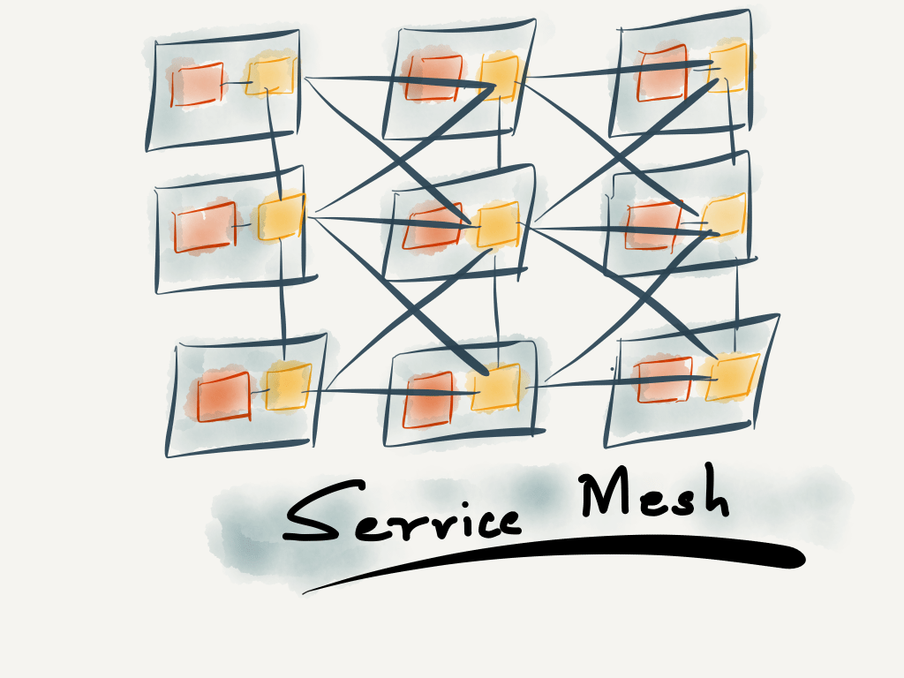
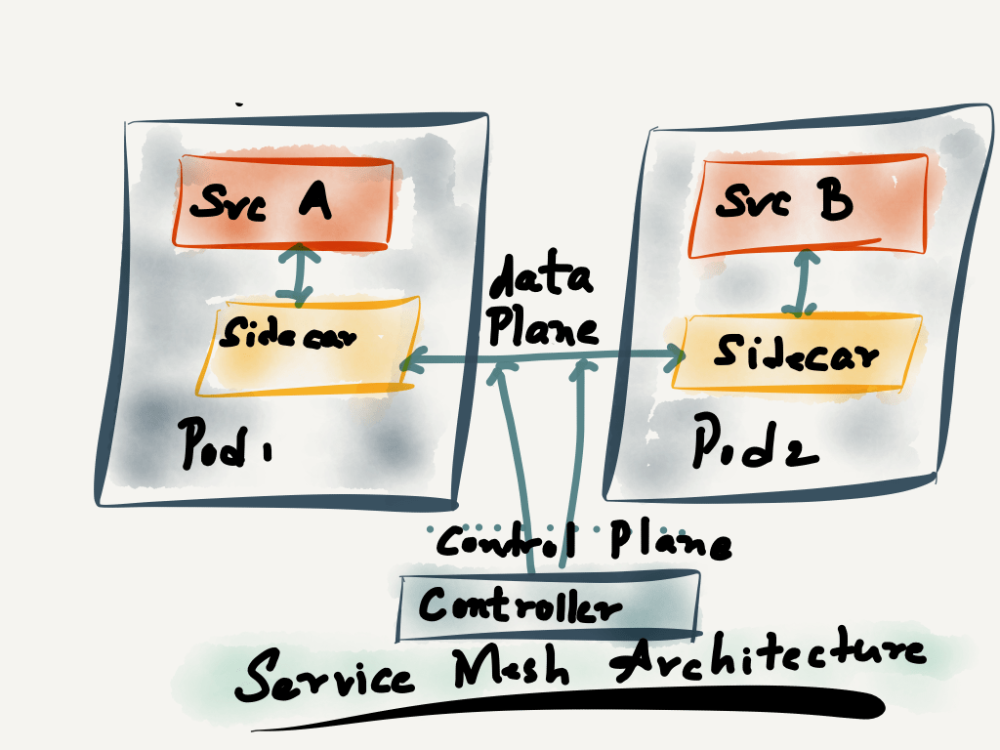
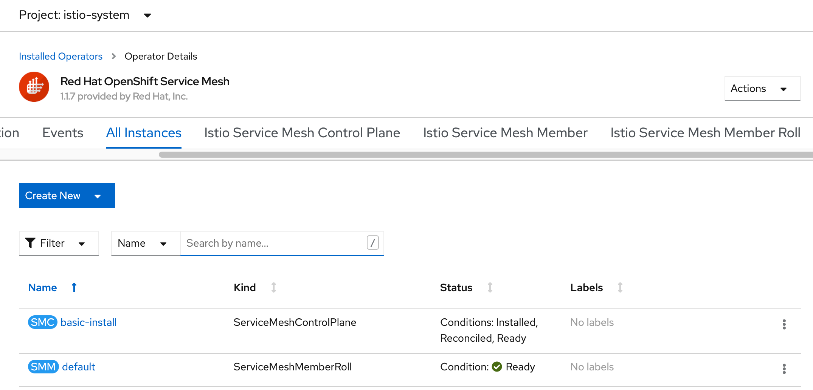

## ServiceMesh 在 Openshift4 上的实现
--简介与安装，基于ocp4.5及istio1.17  

### 什么是ServiceMesh（服务网格）  
ServiceMesh 是一个用于处理服务间通信的基础设施层，它负责为构建复杂的云原生应用传递可靠的网络请求。在实践中，服务网格通常实现为一组和应用程序部署在一起的轻量级的网络代理，但对应用程序来说是透明的。

简单说：业务代码（下图红框）只需关心业务逻辑。其他的事情交给sidercar（边车，下图黄框）来处理，日志记录、监控、流量控制、服务注册、服务发现、服务限流、服务熔断、鉴权、访问控制和服务调用可视化等，这些功能从本质上和业务服务的关系并不大，而传统的软件工程在开发层面完成这些功能，这导致了各种各样维护上的问题。  


Service Mesh 由 data plane（数据平面）构成，其中所有服务通过 sidecar 代理进行服务通信。（所有代理相互连接形成一个 Mesh，Service Mesh 由此得名）网格同时包含一个 control plane --可以将所有独立的 sidecar 代理连接到一个分布式网络中，并设置网格还包括一个控制平面--它将所有独立的 sidecar 代理连接到一个分布式网络中，并设置由 data plane 指定的策略。



Control plane 定义服务发现、路由、流量控制等策略。这些策略可以是全局的，也可以是限定的。Data plane 负责在通信时应用和执行这些策略。

服务网格是解决方案和思路的统称，那具体的架构实现，当前比较流行的开源方案是 istio  

kubernetes 实现了应用的生命周期管理。 istio 在应用的 流量控制（路由/流量镜像/超时/重试/熔断/故障注入）、可观察性（监控可视化/日志/分布式追踪）、安全（认证/授权/证书） 几个方面实现了控制管理。

### istio 简介

Istio 提供了一个完整的解决方案，可以以统一的方式去管理和监测你的微服务应用。同时，它还具有管理流量、实施访问策略、收集数据等方面的能力，而所有的这些都对应用透明，几乎不需要修改业务代码就能实现。

有了 Istio，你几乎可以不再需要其他的微服务框架，也不需要自己去实现服务治理等功能。只要把网络层委托给 Istio，它就能帮你完成这一系列的功能。简单来说，Istio 就是一个提供了服务治理能力的服务网格。

相对于基于公共库的服务治理产品，Service Mesh 最大的特性就是对应用透明。你可以将你的微服务应用无缝的接入网格，而无需修改业务逻辑。目前 Istio 提供了以下重要的功能：

为 HTTP、gRPC、WebSocket 和 TCP 流量自动负载均衡。
通过丰富的路由规则、重试、故障转移和故障注入对流量行为进行细粒度控制。  
提供完善的可观察性方面的能力，包括对所有网格控制下的流量进行自动化度量、日志记录和追踪。  
提供身份验证和授权策略，在集群中实现安全的服务间通信。

Istio service mesh 架构图

Istio 是一个功能十分丰富的 Service Mesh，它包括如下功能：
* 流量管理：这是 Istio 的最基本的功能。
* 策略控制：通过 Mixer 组件和各种适配器来实现，实现访问控制系统、遥测捕获、配额管理和计费等。
* 可观测性：通过 Mixer 来实现。
* 安全认证：Citadel 组件做密钥和证书管理。


istio 的部署独立与平台，可以部署在各种私有 kubernetes 或者公有云提供的 kubernetes，现在也提供了虚拟机（VM）的支持。
总的来说，istio 和 kubernetes 结合的更好，在 kubernetes 上能够发挥他的最大价值和实力。

### Openshift4 安装 ServiceMesh
#### 前置条件
要安装 Red Hat OpenShift Service Mesh Operator，需首先安装以下 Operator：

Elasticsearch - 基于开源的 Elasticsearch 项目，您可以配置和管理 Elasticsearch 集群来使用 Jaeger 进行追踪和日志。
Jaeger - 基于开源 Jaeger 项目，可让您执行追踪来监控复杂分布式系统中的事务并进行故障排除。
Kiali - 基于开源的 Kiali 项目，提供了对服务网格进行观察的功能。通过使用 Kiali，您可以查看配置、监控流量，并在单一控制台中查看和分析 trace。
安装 Elasticsearch 、Jaeger 和 Kiali Operator 后，请安装 Red Hat OpenShift Service Mesh Operator。Service Mesh Operator 定义并监控管理 ServiceMeshControlPlane 资源，这个资源用来管理 Service Mesh 组件的部署、更新和删除操作。

Red Hat OpenShift Service Mesh - 基于开源 Istio 项目，可让您连接、控制并观察组成应用程序的微服务。

安装 Service Mesh 包括安装 Elasticsearch 、Jaeger 、Kiali 和 Service Mesh Operators，创建和管理一个ServiceMeshControlPlane 资源 以部署 control plane，创建一个ServiceMeshMemberRoll 资源以指定与 Service Mesh 关联的命名空间。

**安装Elasticsearch Operator**

如果之前部署过 EFk 日志系统，应该已经做过这一步，可跳过  
进入 web console 页面，Operators -> OperatorHubs，搜索 Elasticsearch 找到 Elasticsearch Operator，选择并点击 Install。  
Create Operator Subscription 页面：  
Installation Mode 选 All namespaces on the cluster (default)  
4.4 和以上版本还有 Installed Namespace 选项，选默认的 openshift-operators-redhat ，不是官方文档说的 openshift-operators
Update Channel更新频道，选最新版本，当前可选最新为 4.5，选它  
Approval Strategy批准策略，选 Automatic  

点击 Install 进行安装

安装结果验证：  
在 Installed Operators 页面，openshift-operators-redhat 这个project 下，  Elasticsearch Operator 的 Status 应该是 Succeeded  
并且在 Workloads -- pods，可以看到 elasticsearch-operator-xx ，Status 应该是 Running，Ready 应该是 1/1  

**安装Jaeger Operator**
同样是在 web console 的 OperatorHubs，搜索 Jaeger。 注意此处必须是选择 Redhat Openshift Jaeger，不要选 Community Jaeger，不支持社区版。  

Update Channel 默认  
Installation Mode 选默认 All namespaces on the cluster (default)
Installed Namespace 也是默认 openshift-operators
Approval Strategy 默认 Automatic

点击 Install 进行安装

安装结果验证：  
在 Installed Operators 页面，openshift-operators 这个project 下，  Red Hat OpenShift Jaeger 的 Status 应该是 Succeeded  
并且在 Workloads -- pods，可以看到 jaeger-operator-xx ，Status 应该是 Running，Ready 应该是 1/1  

**安装Kiali Operator**
同样是在 web console 的 OperatorHubs，搜索 kiali。 注意此处必须选那个 provided by Red Hat，不要选社区版。  

参数全部默认值，点击 Install 进行安装

安装结果验证：  
在 Installed Operators 页面，openshift-operators 这个project 下， Kiali Operator 的 Status 应该是 Succeeded  
并且在 Workloads -- pods，可以看到 kiali-operator-xx ，Status 应该是 Running，Ready 应该是 2/2  

至此，三个前置条件 Elasticsearch Operator，Jaeger Operator，Jaeger Operator 已完成。

#### 安装 Red Hat OpenShift Service Mesh Operator
还是在 web console 的 OperatorHubs，搜索 servicemesh，找到 Red Hat OpenShift Service Mesh，我当前是 ocp4.5，带的 istio 是1.17版本。

参数都选择默认，点击 Install 进行安装  
Update Channel： stable
Installation Mode： All namespaces on the cluster (default)  
Installed Namespace： openshift-operators  
Approval Strategy： Automatic

安装结果验证：  
在 Installed Operators 页面，openshift-operators 这个project 下， Red Hat OpenShift Service Mesh 的 Status 应该是 Succeeded  
并且在 Workloads -- pods，可以看到 istio-operator-xx ，Status 应该是 Running，Ready 应该是 1/1  

#### 通过自定义资源完成 ServiceMesh 安装
通过 ServiceMeshControlPlane 这个自定义资源对象来创建 istio 组件，也就是控制平面

先创建一个 namespace(名称自定义) 如 istio-system 或其他，然后通过 oc 命令或者页面导入以下 yaml  
页面导入方法：  
Operators - Installed Operators，进入 Red Hat OpenShift Service Mesh，在菜单 ‘Istio Service Mesh Control Plane’  选择 ‘Create ServiceMeshControlPlane’，提供了常用参数的可视化选项，也可以通过导入 yaml 方式填入以下内容。注意选择上面所创建的project

示例：  
```bash
apiVersion: maistra.io/v1
kind: ServiceMeshControlPlane
metadata:
  name: basic-install
spec:

  istio:
    global:
      proxy:
        resources:
          requests:
            cpu: 100m
            memory: 128Mi
          limits:
            cpu: 500m
            memory: 128Mi

    gateways:
      istio-egressgateway:
        autoscaleEnabled: false
      istio-ingressgateway:
        autoscaleEnabled: false
        ior_enabled: false

    mixer:
      policy:
        autoscaleEnabled: false

      telemetry:
        autoscaleEnabled: false
        resources:
          requests:
            cpu: 100m
            memory: 1G
          limits:
            cpu: 500m
            memory: 4G

    pilot:
      autoscaleEnabled: false
      traceSampling: 100

    kiali:
      enabled: true

    grafana:
      enabled: true

    tracing:
      enabled: true
      jaeger:
        template: all-in-one
```

完成后是这样，如果遇到 ImagePullBackOff 问题参照最后FAQ，解释了针对离线环境，可能遇到的两种情况下的镜像拉取失败解决方法。
```bash
[root@bastion redhat-operators-manifests]# oc get pod
NAME                                      READY   STATUS    RESTARTS   AGE
grafana-54966d55d5-qxbfc                  2/2     Running   0          49m
istio-citadel-6f9b74b754-djrmt            1/1     Running   0          24h
istio-egressgateway-64ffbdb8c8-jgmpm      1/1     Running   0          57m
istio-galley-7c6fb78655-2dhr5             1/1     Running   0          61m
istio-ingressgateway-6c77fdbbd4-65zvs     1/1     Running   0          57m
istio-pilot-f74779745-g6n7t               2/2     Running   0          59m
istio-policy-884697ff7-pkh75              2/2     Running   0          61m
istio-sidecar-injector-66fd9459d9-6cj6p   1/1     Running   0          49m
istio-telemetry-5d8b8bf754-khdfx          2/2     Running   0          60m
jaeger-96d4ff7b4-hx4g8                    2/2     Running   0          5m42s
kiali-7bd96549bd-x87lr                    1/1     Running   0          46m
prometheus-698fbc5fbf-5hklw               2/2     Running   1          24h
```

对于多租户环境，Red Hat OpenShift Service Mesh 支持集群中有多个独立 control plane。您可以使用 ServiceMeshControlPlane 模板生成可重复使用的配置。 也就是上面的 yaml 文件导入到不同的 project 就可以生成多个 istio 控制平台，可以按需进行配置参数的调整。  

ServiceMeshMemberRoll 这个资源对象列出了属于 control plane 的项目。只有 ServiceMeshMemberRoll 中列出的项目会受到 control plane 的影响。在将项目添加到特定 control plane 部署的 member roll 之前，项目不属于服务网格。

您必须在 ServiceMeshControlPlane 所在的同一个项目中创建一个名为 default 的 ServiceMeshMemberRoll 资源。

方法同样是在 web console， Installed Operators，进入 Red Hat OpenShift Service Mesh，project 要选择与 controlplane 一致，在菜单 ‘Istio Service Mesh Member Roll’  选择 ‘Create ServiceMeshMemberRoll’，提供了常用参数的可视化选项，也可以通过导入 yaml 方式填入以下内容。

```bash
# 这个 bookinfo project 先创建好，可以支持多个 project，但每个project只能属于一个 ServiceMeshMemberRoll 资源。
apiVersion: maistra.io/v1
kind: ServiceMeshMemberRoll
metadata:
  name: default
  namespace: istio-system
spec:
  members:
    # a list of projects joined into the service mesh
    - bookinfo

```    



至此 servicemesh istio 框架部署完成，下一步将通过 bookinfo demo 来进一步熟悉 istio 架构和使用。

### FAQ
两次问题都是镜像拉取失败，离线ocp4 环境，如果使用在线redhatimage-registry不会存在这个问题，那种情况用不到mirror功能。  
原因是ocp4 的mirror 功能不支持 tag 方式，只支持 digest 也就是 @sha256 这种方式  
官方说明在此：
https://bugzilla.redhat.com/show_bug.cgi?id=1790798
https://access.redhat.com/articles/4975041

这就是为什么我私有仓库里有 registry.example.com:5000/openshift4/ose-oauth-proxy:4.2 镜像，也做了mirror配置，而拉取 registry.redhat.io/openshift4/ose-oauth-proxy:4.2 就是会失败。

#### issue1： Failed to pull image "registry.redhat.io/openshift4/ose-oauth-proxy:4.2"
问题概述：
prometheus-698fbc5fbf-5hklw 这个pod 镜像拉取失败，按理说，我应该参照 issue2 的解决方法，去 clusterserviceversions.operators.coreos.com 这个对象里面去修改，但是我找遍集群所有 clusterserviceversions.operators.coreos.com 和所有pod，没有可以修改这个镜像地址的地址，所以使用了一种笨办法。

问题现象：
```bash
[root@bastion ~]# oc get pod
NAME                             READY   STATUS             RESTARTS   AGE
istio-citadel-6f9b74b754-djrmt   1/1     Running            0          14s
prometheus-698fbc5fbf-5hklw      1/2     ImagePullBackOff   0          10s
Events:
  Type     Reason          Age                From                               Message
  ----     ------          ----               ----                               -------
  Normal   Scheduled       <unknown>          default-scheduler                  Successfully assigned istio-system/prometheus-698fbc5fbf-5hklw to master0.ocp4.example.com
  Normal   AddedInterface  38s                multus                             Add eth0 [10.254.0.42/24]
  Normal   Pulled          36s                kubelet, master0.ocp4.example.com  Container image "registry.redhat.io/openshift-service-mesh/prometheus-rhel8@sha256:1b70dfedb073936b2bc900b632917a6c2c8e27efcf94d526e1834295a34edfb7" already present on machine
  Normal   Created         36s                kubelet, master0.ocp4.example.com  Created container prometheus
  Normal   Started         36s                kubelet, master0.ocp4.example.com  Started container prometheus
  Normal   BackOff         35s (x2 over 36s)  kubelet, master0.ocp4.example.com  Back-off pulling image "registry.redhat.io/openshift4/ose-oauth-proxy:4.2"
  Warning  Failed          35s (x2 over 36s)  kubelet, master0.ocp4.example.com  Error: ImagePullBackOff
  Normal   Pulling         24s (x2 over 38s)  kubelet, master0.ocp4.example.com  Pulling image "registry.redhat.io/openshift4/ose-oauth-proxy:4.2"
  Warning  Failed          23s (x2 over 36s)  kubelet, master0.ocp4.example.com  Error: ErrImagePull
  Warning  Failed          23s (x2 over 36s)  kubelet, master0.ocp4.example.com  Failed to pull image "registry.redhat.io/openshift4/ose-oauth-proxy:4.2": rpc error: code = Unknown desc = unable to retrieve auth token: invalid username/password: unauthorized: Please login to the Red Hat Registry using your Customer Portal credentials. Further instructions can be found here: https://access.redhat.com/RegistryAuthentication
```

解决方法：
在 pod 所有节点，先用私有仓库地址把镜像拉下来，再 tag 成 registry.redhat.io 
```bash
[core@master0 ~]$ sudo crictl pull registry.example.com:5000/openshift4/ose-oauth-proxy:4.2
Image is up to date for registry.example.com:5000/openshift4/ose-oauth-proxy@sha256:4be6afd636c51f83fdd9118eb12768a23acd2c5cd0786b986bf80a9450a5c697
[core@master0 ~]$ sudo podman tag registry.example.com:5000/openshift4/ose-oauth-proxy:4.2 registry.redhat.io/openshift4/ose-oauth-proxy:4.2 
```

#### issue2： Failed to pull image "registry.redhat.io/openshift4/ose-oauth-proxy:latest"

问题现象： 同样是镜像拉取失败，不过这个我找到了配置的地方。

```bash
[root@bastion ~]# oc get pod
NAME                                      READY   STATUS             RESTARTS   AGE
grafana-54966d55d5-qxbfc                  2/2     Running            0          9m40s
istio-citadel-6f9b74b754-djrmt            1/1     Running            0          24h
istio-egressgateway-64ffbdb8c8-jgmpm      1/1     Running            0          18m
istio-galley-7c6fb78655-2dhr5             1/1     Running            0          22m
istio-ingressgateway-6c77fdbbd4-65zvs     1/1     Running            0          18m
istio-pilot-f74779745-g6n7t               2/2     Running            0          19m
istio-policy-884697ff7-pkh75              2/2     Running            0          21m
istio-sidecar-injector-66fd9459d9-6cj6p   1/1     Running            0          10m
istio-telemetry-5d8b8bf754-khdfx          2/2     Running            0          21m
jaeger-77f49889b4-p274g                   1/2     ImagePullBackOff   0          22m
kiali-7bd96549bd-x87lr                    1/1     Running            0          7m21s
prometheus-698fbc5fbf-5hklw               2/2     Running            1          24h

jaeger-77f49889b4-p274g  的 event   
Normal   BackOff         9m28s (x41 over 19m)  kubelet, master0.ocp4.example.com  Back-off pulling image "registry.redhat.io/openshift4/ose-oauth-proxy:latest"
```

解决方法：
注意要在 openshift-operators 这个 project 下，因为 jaeger 部署在这个下面

```bash
～ oc -n openshift-operators get clusterserviceversions.operators.coreos.com|grep jaeger
jaeger-operator.v1.17.6                        Red Hat OpenShift Jaeger         1.17.6                             Succeeded
～ oc -n openshift-operators get pod|grep jaeger
jaeger-operator-697c7889b-vkd87   1/1     Running   0          20m

# 修改配置
～ oc -n openshift-operators edit clusterserviceversions.operators.coreos.com jaeger-operator.v1.17.6 
找到 registry.redhat.io/openshift4/ose-oauth-proxy:latest 改成 registry.example.com:5000/openshift4/ose-oauth-proxy:latest  

之后 jaeger-operator-xx 这个pod 会重建

```

再回到 istio-system project 下，删掉 jaeger-xx pod 重建，就正常了
```bash
[root@bastion redhat-operators-manifests]# oc get pod
NAME                                      READY   STATUS    RESTARTS   AGE
grafana-54966d55d5-qxbfc                  2/2     Running   0          49m
istio-citadel-6f9b74b754-djrmt            1/1     Running   0          24h
istio-egressgateway-64ffbdb8c8-jgmpm      1/1     Running   0          57m
istio-galley-7c6fb78655-2dhr5             1/1     Running   0          61m
istio-ingressgateway-6c77fdbbd4-65zvs     1/1     Running   0          57m
istio-pilot-f74779745-g6n7t               2/2     Running   0          59m
istio-policy-884697ff7-pkh75              2/2     Running   0          61m
istio-sidecar-injector-66fd9459d9-6cj6p   1/1     Running   0          49m
istio-telemetry-5d8b8bf754-khdfx          2/2     Running   0          60m
jaeger-96d4ff7b4-hx4g8                    2/2     Running   0          5m42s
kiali-7bd96549bd-x87lr                    1/1     Running   0          46m
prometheus-698fbc5fbf-5hklw               2/2     Running   1          24h
```

### 参考资料
https://www.servicemesher.com/istio-handbook/concepts/istio.html
https://docs.openshift.com/container-platform/4.4/service_mesh/service_mesh_install/preparing-ossm-installation.html
https://access.redhat.com/documentation/zh-cn/openshift_container_platform/4.5/html/service_mesh/service-mesh-installation#preparing-ossm-installation

