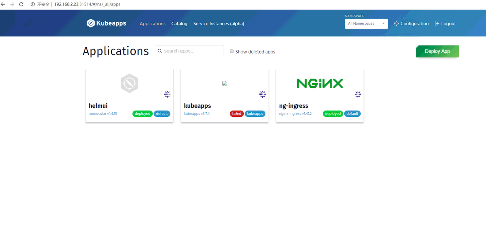
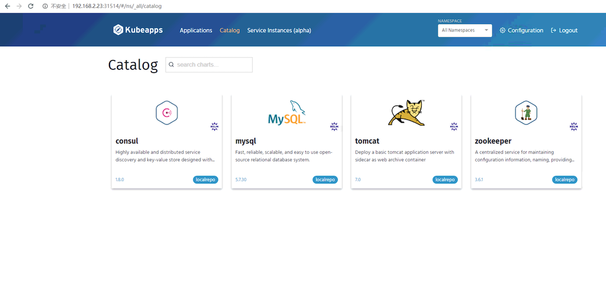

## 搭建私有helm仓库及图形界面
本篇主要介绍私有 helm 仓库 Chartmuseum 及图形界面 Monocular UI /kubeapps 的搭建

helm chart 能够很好的封装和管理我们的 kubernetes 应用，可以实现中间件、数据库、公共组件等快速发布。  
什么场景下我们需要构建一个私有的helm仓库呢  
1. 首先我们日常发布中肯定是经常使用到了helm   
2. 有较多自定义的或者调整过的helm模板，或者有多套k8s/ocp 集群要同时基于 helm 进行发布与管理
3. 如果想要要更好的管理 charts 历史版本，可以使用下面说的 github page 或者 gitlab page

Helm chart对仓库的要求并不高，需要你对外提供yaml文件和tar文件的web服务即可。helm2 原本是带了本地仓库功能，helm3 移除了这部分，将他变成了一个纯粹的应用管理工具。  

像 harborimage-registry，JFrog Artifactory(制品仓库，image-registry) 都包含了 helm 商店的功能，如果同时对image-registry和制品管理有需求，可以选择上面两款产品，都提供免费社区版。  

如果不需要上面两者的image-registry功能，可以使用在线的github 或 gitlab
https://www.bookstack.cn/read/kubernetes-handbook-201910/practice-create-private-charts-repo.md

也可以是本地私有化部署的 gitlab 
https://my.oschina.net/doctorlzr1988/blog/3044964

又或者是helm 开源得工具 chartmuseum  
https://github.com/helm/chartmuseum

Chartmuseum 除了给我们提供一个类似于web服务器的功能之外，还提供了其他有用的功能，便于日常我们私有仓库的管理。

- 根据chart文件自动生成index.yaml(无须使用helm repo index手动生成)
- helm push的插件，可以在helm命令之上实现将chart文件推送到chartmuseum上
- 相应的tls配置，Basic认证，JWT认证（Bearer token认证）
- 提供了Restful的api（可以使用curl命令操作）和可以使用的cli命令行工具
- 提供了各种后端存储的支持（Amazon s3, Google Cloud Storage, 阿里、百度、腾讯，开源对象存储等）
- 提供了Prometheus的集成，对外提供自己的监控信息。
- 没有用户的概念，但是基于目录实现了一定程度上的多租户的需求。

### 1. Chartmuseum 搭建
直接使用最简单的 docker run 方式，使用local 本地存储方式，通过 -v 映射到宿主机 /opt/charts    
更多支持安装方式见官网  

```bash
mkdir /opt/charts

docker run -d \
  -p 8080:8080 \
  -e DEBUG=1 \
  -e STORAGE=local \
  -e STORAGE_LOCAL_ROOTDIR=/charts \
  -v /opt/charts:/charts \
  chartmuseum/chartmuseum:latest

# 使用 curl 测试下接口，没有报错就行，当前仓库内容还是空的
# curl localhost:8080/api/charts
{}

```

### 2. 准备 helm 及离线 chart，推送到私有库
给我们的私有仓库准备些chart，可以是自己生成的或者从公共仓库获取

先安装 helm3， 添加源
```bash
# 添加官方源，网络不好可以试试下面微软的
helm repo add stable https://kubernetes-charts.storage.googleapis.com
helm repo add incubator https://kubernetes-charts-incubator.storage.googleapis.com

# 也可以换成微软的源，速度快，内容和官方同步的 
helm repo add az-stable http://mirror.azure.cn/kubernetes/charts/
helm repo add az-incubator http://mirror.azure.cn/kubernetes/charts-incubator/
```

```bash
### 把 charts 文件直接下载到 chartmuseum 指定的本地目录
cd /opt/charts
helm search repo mysql

# 将charts 文件下载到本地
helm pull az-stable/mysql
helm pull az-stable/tomcat
...

# ls
mysql-1.6.6.tgz  tomcat-0.4.1.tgz
 
```

测试仓库接口，能正常返回已有的 helm charts 信息，说明 charts 文件放到对应目录下，仓库会自动更新  
```bash
[root@bastion charts]# curl localhost:8080/api/charts |jq
  % Total    % Received % Xferd  Average Speed   Time    Time     Time  Current
                                 Dload  Upload   Total   Spent    Left  Speed
100  1833  100  1833    0     0   349k      0 --:--:-- --:--:-- --:--:--  358k
{
  "mysql": [
    {
      "name": "mysql",
      "home": "https://www.mysql.com/",
      "sources": [
        "https://github.com/kubernetes/charts",
        "https://github.com/docker-library/mysql"
      ],
      "version": "1.6.6",
      "description": "Fast, reliable, scalable, and easy to use open-source relational database system.",
      "keywords": [
        "mysql",
        "database",
        "sql"

...
```

也可以使用 helm push 插件上传
```bash
# 安装 helm push 插件
helm plugin install https://github.com/chartmuseum/helm-push.git

# 从官网下载一个 consul
helm search repo consul
helm pull az-stable/consul 

# 添加本地仓库到 helm repo，看下仓库内容
helm repo add localrepo http://192.168.2.19:8080
helm search repo localrepo
    NAME            	CHART VERSION	APP VERSION	DESCRIPTION                                       
    localrepo/mysql 	1.6.6        	5.7.30     	Fast, reliable, scalable, and easy to use open-...
    localrepo/tomcat	0.4.1        	7.0        	Deploy a basic tomcat application server with s...

# helm push 推送 postgres
helm push consul-7.1.3.tgz localrepo
如果出现报错，权限问题 "Error: 500: open /charts/consul-7.1.3.tgz: permission denied
Error: plugin "push" exited with error" 
直接给本地目录权限最大， 再次push  chmod 777 -R /opt/charts/

# 更新本地 repo，查看仓库内容，可以看到新上传的 postgres
helm repo update 
[root@bastion charts]# helm search repo localrepo

    NAME                	CHART VERSION	APP VERSION	DESCRIPTION                                       
    localrepo/consul      7.1.3         1.8.0       Highly available and distributed service discov...
    localrepo/mysql     	1.6.6        	5.7.30     	Fast, reliable, scalable, and easy to use open-...
    localrepo/tomcat    	0.4.1        	7.0        	Deploy a basic tomcat application server with s...
```

### 3. 安装 ingress controller
Monocular UI 必须依赖ingress，如果环境里没有，先安装一个

```bash
helm search repo ingress
helm install ng-ingress az-stable/nginx-ingress 
```

### 4. 安装Monocular UI 界面，管理helm charts
官方站点 https://github.com/helm/monocular

通过 helm 方式来安装

```bash
helm repo add monocular https://helm.github.io/monocular
# helm install monocular/monocular

# 下载chart，把mongodb 存储改成持久化
helm pull monocular/monocular
tar -zxvf monocular-1.4.15.tgz 
vim values.yaml 
在 repos 注释自带的stable 和incubator 4行，添加 localrepo， 地址是 http://192.168.2.19:8080
修改 mongodb.persistence.enabled 为 true

# 安装
helm install helmui .
```

访问通过 ingress controller 的nodeport， 不是直接通过 monocular 的 nodeport，可以看下ingress 的内容就了解了。

```bash
[root@bastion ~]# kubectl get svc  |grep ingress
ng-ingress-nginx-ingress-controller        LoadBalancer   172.30.241.122   <pending>                              80:31537/TCP,443:30814/TCP   4h53m
ng-ingress-nginx-ingress-default-backend   ClusterIP      172.30.91.91     <none>                                 80/TCP                       4h53m
```

通过浏览器访问 k8s节点ip:31537  
标记 deprecated: true 的charts，即为弃用的，不会展示在页面  


默认是1小时同步一次repo，可以在helm install 的时候修改 values.yaml，比如这样，5分钟同步一次

```bash
    - name: incubator
      url: https://kubernetes-charts-incubator.storage.googleapis.com
      schedule: "*/5 * * * *"
```

或者部署之后修改 cronjob，修改       schedule: "*/5 * * * *"

```bash
[root@bastion ~]# kubectl get cronjob
NAME                                        SCHEDULE    SUSPEND   ACTIVE   LAST SCHEDULE   AGE
helmui-monocular-sync-scheduled-localrepo   0 * * * *   False     0        8m57s           3d
[root@bastion ~]# kubectl edit cronjob helmui-monocular-sync-scheduled-localrepo 
```

### 5. 另一款界面管理工具 kubeapps 

kubeapps 和 monocular 类似，都是bitnami 公司维护的，多了已发布helm 应用的查看，以及可以通过页面添加 repo，功能比上面的多，建议用这个。   
使用方法见官网  
https://github.com/kubeapps/kubeapps  

注意访问的时候是使用 kubeapps 这个svc 的nodeport， 不依赖于ingress  

查看通过 helm 发布的应用，支持按照 namespace 区分  


这块和 monocular 一样  


可以通过页面添加仓库


