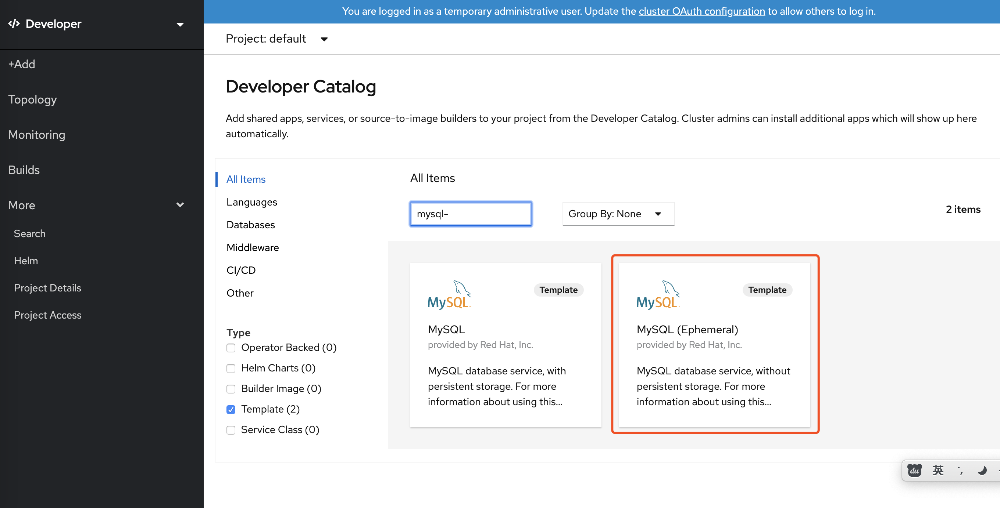
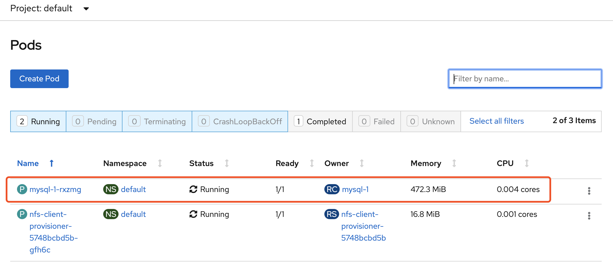

openshift sample operator 负责安装和更新 imagestream 和 template。  
通过openshift 自带的模板 catalog 或者 from git，database， 都会使用到imagestream 和 template  
离线环境下 imagestream 关联的镜像在初始部署中未曾下载， 需要在部署完成后手动补充，并修改image_registry地址指向。

### 1. 获取镜像列表并同步到本地仓库
系统自带的imagestream 都在名为openshift 这个 project 下  
```bash
oc project openshift 
oc get is

# 查看所有imagestream 指向的初始地址
# 除了 jenkins 指向 quay.io，这些镜像在初始部署时候已经同步过了
# 其余的都是 registry.redhat.io
for i in `oc get is -n openshift --no-headers | awk '{print $1}'`; do oc get is $i -n openshift -o json | jq .spec.tags[].from.name ; done
```

把 registry.redhat.io 的镜像列表写入到文件，一共200多个镜像。  
可以按需选择自己需要的，不想要的可以直接删掉内容。或者使用 oc patch，比如不要同步jenkins  
```bash
oc patch configs.samples.operator.openshift.io/cluster --patch '{"spec":{"skippedImagestreams":["jenkins", "jenkins-agent-maven", "jenkins-agent-nodejs"]}}' --type=merge
```

```bash
for i in `oc get is -n openshift --no-headers | awk '{print $1}'`; do oc get is $i -n openshift -o json | jq .spec.tags[].from.name | grep registry.redhat.io | sed -e 's/"//g' | cut -d"/" -f2-; done | tee imagelist.txt

[root@bastion ~]# cat imagelist.txt 
3scale-amp21/apicast-gateway:1.4-2
3scale-amp22/apicast-gateway:1.8
3scale-amp23/apicast-gateway
3scale-amp24/apicast-gateway
3scale-amp25/apicast-gateway
3scale-amp26/apicast-gateway
3scale-amp2/apicast-gateway-rhel7:3scale2.7
fuse7/fuse-apicurito:1.2
fuse7/fuse-apicurito:1.3
fuse7/fuse-apicurito:1.4
fuse7/fuse-apicurito:1.5
...
```

把 registry.redhat.io 和 registry.example.com:5000 的登录认证写入到文件 pull-secret.json   
然后使用 oc image mirror 命令将镜像同步到本地仓库，需要制定 pull-secret.json 文件

```bash
podman login --authfile /root/pull-secret.json registry.example.com:5000
podman login --authfile /root/pull-secret.json registry.redhat.io

for i in `cat imagelist.txt`; do oc image mirror -a /root/pull-secret.json registry.redhat.io/$i registry.example.com:5000/$i; done
```

镜像同步完成后，image_registry数据文件 /opt/registry/data 大小约 70G

### 2. 修改sample operator 配置以更新imagestream

更新之前可以看下 sample operator 的状态，message 提示镜像导入失败
```bash
[root@bastion ~]# oc get co openshift-samples -o yaml
...
status:
  conditions:
  - lastTransitionTime: "2020-07-14T10:21:16Z"
    message: Samples installation successful at 4.4.9
    status: "True"
    type: Available
  - lastTransitionTime: "2020-07-14T12:17:19Z"
    message: 'Samples installation in error at 4.4.9: FailedImageImports'
    status: "True"
    type: Progressing
  - lastTransitionTime: "2020-07-20T08:41:57Z"
    message: 'Samples installed at 4.4.9, with image import failures for these imagestreams:
      fuse7-karaf-openshift jboss-datagrid65-client-openshift mysql dotnet-runtime
      modern-webapp openjdk-11-rhel7 jboss-fuse70-karaf-openshift apicast-gateway
      
      ...
      python redhat-openjdk18-openshift jboss-datagrid65-openshift mongodb jboss-processserver64-openshift
      ; last import attempt 2020-07-20 08:41:55 +0000 UTC'
    reason: FailedImageImports
    status: "True"
    type: Degraded
...
```

修改 sample operator的 samplesRegistry 参数，指向内部仓库 registry.example.com:5000 ，会自动触发镜像重新导入的过程

```bash
oc patch configs.samples.operator.openshift.io/cluster --patch '{"spec":{"samplesRegistry": "registry.example.com:5000" }}' --type=merge
```

oc describe configs.samples.operator.openshift.io/cluster 在 message 中可以看到日志 
(如果出现这个错误，见最后FAQ https://registry.example.com:5000/v2/: x509: certificate signed by unknown authority)

修改后，正常会触发imagestream的重新导入，如果没有触发，用如下命令：
```bash
oc patch configs.samples.operator.openshift.io/cluster --patch '{"spec":{"managementState": "Removed" }}' --type merge
```

等待20秒：
```bash
oc patch configs.samples.operator.openshift.io/cluster --patch '{"spec":{"managementState": "Managed" }}' --type merge
```

成功后 
oc describe configs.samples.operator.openshift.io/cluster   
oc describe co openshift-samples  
这两处 message 应该没有报错，或者是自己可预料的情况，比如某些镜像在之前没有同步。  

### 3. 通过 template 发布 mysql （可选项）
在 console 页面切到 developer 角色，选择 mysql 的模板，模板会使用到 mysql 的imagestream，可以测试下镜像是否导入成功  
搜索mysql，有存储选左边的，没有可用存储就选右边的  


发布完成后，在 Administrator 角色，Workloads -- pods 可以查看到最终运行的 mysql 实例  


### 4. FAQ
1. imagestream 指向私有仓库 X509  
oc describe configs.samples.operator.openshift.io/cluster 在 message 中可以看到日志  
https://registry.example.com:5000/v2/: x509: certificate signed by unknown authority

原因： 未导入私有仓库证书  
解决： 导入私有仓库证书或者配置insec registry  
把证书加到信任配置中，注意 5000 端口前面是两个点，不是冒号  
```bash
oc create configmap registry-config --from-file=registry.example.com:5000..5000=/opt/registry/certs/domain.crt -n openshift-config
oc patch image.config.openshift.io/cluster --patch '{"spec":{"additionalTrustedCA":{"name":"registry-config"}}}' --type=merge
```
按理说这样应该就可以了，但是没有生效，原因不明。。。官网说machine config 会监听这个配置文件，然。。。

然后我用了第二种方法，把仓库加到 insecure 中
```bash
oc edit image.config.openshift.io cluster
# 加入 registrySources: insecureRegistries: 的内容
...

spec:
  additionalTrustedCA:
    name: registry-config
  registrySources:
    insecureRegistries:
    - registry.example.com:5000
...

```
修改后， oc get node 节点的状态会依次变成 SchedulingDisabled 来更新配置，节点都更新完成后，查看配置文件  /etc/containers/registries.conf  
会看到这个配置信息，就是我们新增的非安全仓库  

[[registry]]
  prefix = ""
  location = "registry.example.com:5000"
  insecure = true
