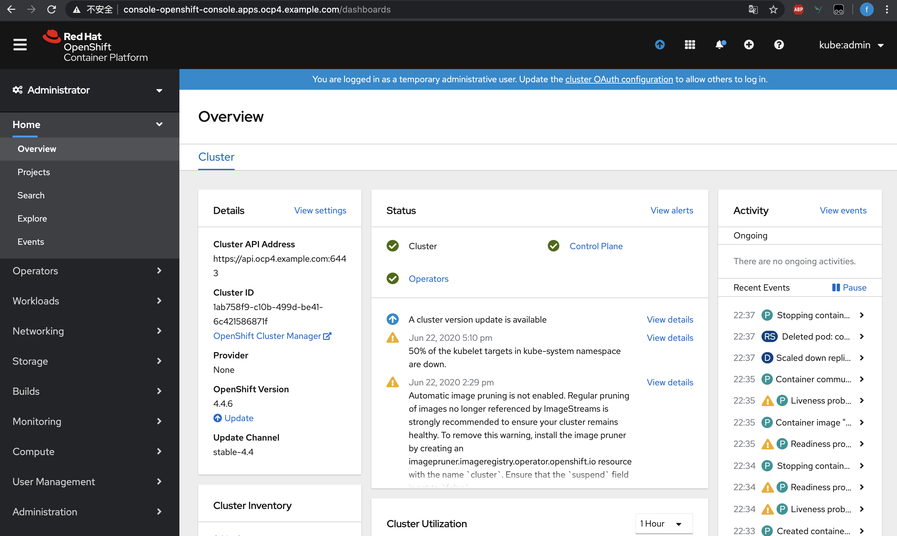

## 访问 openshift web 控制台
openshift web console 在集群部署中会默认安装。会提供一个友好的 web 管理页面，满足绝大部分场景的业务发布与维护。及一些平台配置参数维护。

### 配置域名解析

首先，找到访问的域名，和router 所在节点
```bash
[root@bastion ~]# oc get route -A |grep console-
openshift-console          console             console-openshift-console.apps.ocp4.example.com                       console             https   reencrypt/Redirect     None

[root@bastion ~]# oc get route -A |grep oauth
openshift-authentication   oauth-openshift     oauth-openshift.apps.ocp4.example.com                                 oauth-openshift     6443    passthrough/Redirect   None

[root@bastion ~]# oc get pod -owide -A|grep route
openshift-ingress                                       router-default-679488d97-pt5xh                                    1/1     Running     0          31h     192.168.2.22   master0.ocp4.example.com   <none>           <none>
```

把两个域名 console-openshift-console.apps.ocp4.example.com oauth-openshift.apps.ocp4.example.com 解析到 192.168.2.22 

写入hosts，或者配置到dnsserver。 如果有多个router，且配置了负载，则解析到负载ip。

### 访问 web 页面

通过浏览器访问 https://console-openshift-console.apps.ocp4.example.com

初始密码在部署机。  
用户名: kubeadm  
密码在文件中
```bash
[root@bastion ~]# cat /opt/install/auth/kubeadmin-password
JzPpM-hVUJn-o2PD7-RKtoe
```



