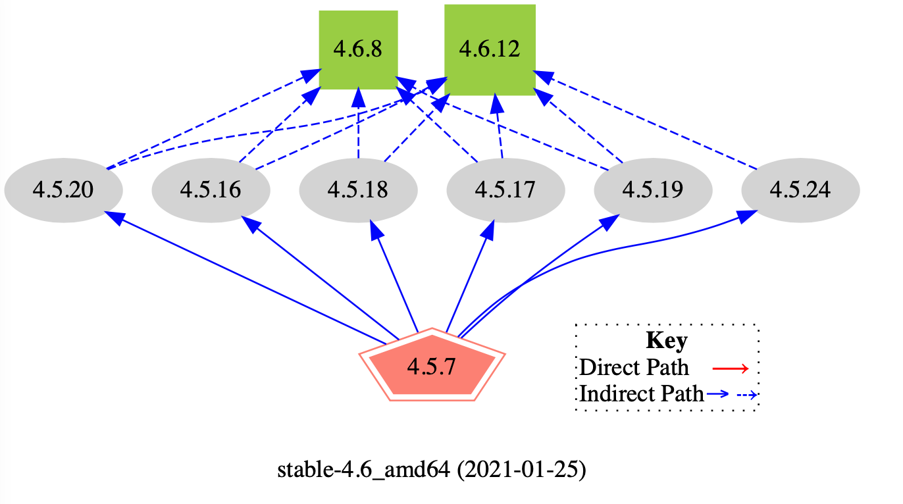
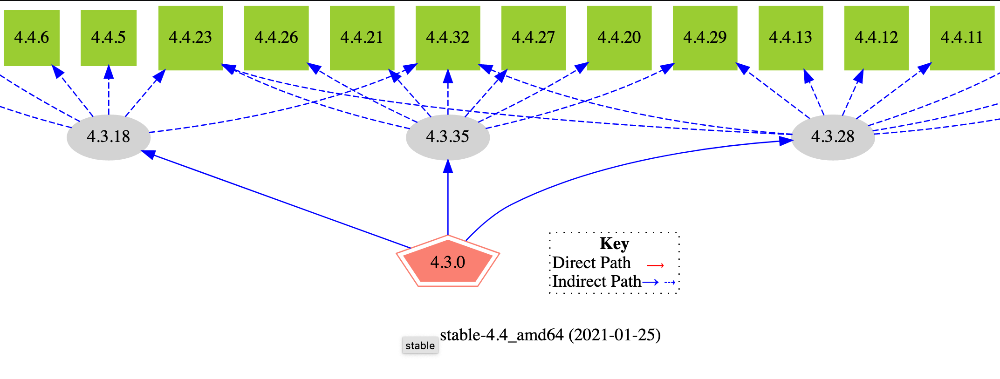
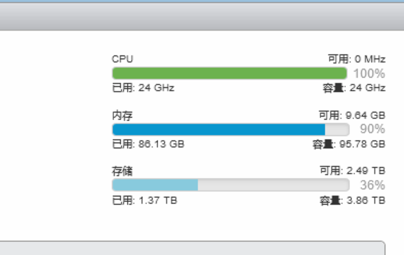

## openshift4离线升级 4.5 到 4.6

记录openshift离线环境从 4.5 到 4.6，主要是为了熟悉下 openshift4 的升级机制，和 3 差异很大。  
本次计算节点均为rhcos，若计算节点为RHEL，还需执行另外的 ansibl额、 更新动作，详见官网。  

升级过程概述：  
1. 计算升级路径  
2. 数据备份
3. 获取离线更新文件
4. 执行升级动作

### 计算升级路径

首先明确 4.2 -> 4.4 这种连跳两个版本号的方式的不受官方支持的。  

这就是为什么我们要先计算升级路径的方法，如果你是4.3，可能路径是
4.3->4.4->4.5->4.6  

实际路径可以通过下面的工具来计算及规划

```bash
git clone https://github.com/pamoedom/ocp4upc.git
cd ocp4ucp

# 依赖文件jq curl dot，通过yum 安装
yum install curl jq graphviz

[root@centos7 ocp4upc]# ./ocp4upc.sh 4.5.7
[INFO] Checking prerequisites (curl jq dot)... [OK] 
[INFO] Errata provided (4.x.z mode), targeting '4.6' channels for upgrade path generation.
[INFO] Checking if '4.5.7' (amd64) is a valid release... [OK] 
[WARN] Discarding channel 'fast-4.6_amd64', it doesn't differ from 'stable-4.6_amd64'.
[WARN] Skipping channel 'eus-4.6_amd64', version '4.5.7' not found.
[INFO] Result exported as 'stable-4.6_amd64_20210125.svg'

```

把结果导出来用浏览器打开
4.5.7 -> 4.6.12 标准流程是这样的，正式环境请严格遵循规范。

4.5.7 -> 4.5.24 -> 4.6.12


4.3.0 的升级路径  
4.3.0 -> 4.3.35 -> 4.4.32


官方指导升级路径链接  
https://access.redhat.com/solutions/4606811
https://access.redhat.com/solutions/4583231

### 数据备份

升级之前建议备份 etcd，如果失败了可以恢复。openshift 升级是不支持回滚的。  
我这是测试环境，偷懒了，后面有机会单独写备份和恢复，以前在 ocp3 环境做过这些，虽有差异，这次就节约时间了。  

正式环境一定要做！一定！一定！  

https://access.redhat.com/documentation/en-us/openshift_container_platform/4.5/html-single/backup_and_restore/index#backup-etcd

### 获取离线文件并同步

使用一台可联网的虚机，拉取更新所需镜像，然后打包传送到内网环境。

#### 获取最新的 openshift client

在 Command-line interface 部分，从下拉菜单中选择 Linux，并点 Download command-line tools 及 Pull secret  
https://cloud.redhat.com/openshift/install/metal/user-provisioned

```bash
tar xvzf openshift-client-linux.tar.gz 
chmod +x oc kubectl 
mv oc kubectl /usr/local/bin/

# oc version
Client Version: 4.6.12
```

#### 运行一个本地的镜像仓库，用于将更新的镜像同步到本地

```bash
yum install podman -y
mkdir -p /opt/registry/{auth,certs,data}

```

为 registry 提供证书。如果您没有现有的可信证书颁发机构，您可以生成自签名证书。
registry.example.com 是仓库的域名，自己定义，不要求和主机名一致。  

```bash
cd /opt/registry/certs
openssl req -subj '/CN=registry.example.com/O=My Company Name LTD./C=US' -new -newkey rsa:2048 -days 3650 -nodes -x509 -keyout domain.key -out domain.crt
```

将自签名的证书复制到默认信任证书路径

```bash
cp /opt/registry/certs/domain.crt /etc/pki/ca-trust/source/anchors/
update-ca-trust extract
```

给仓库生成用户密码，root password分别为仓库的用户名和密码。

```bash
htpasswd -bBc /opt/registry/auth/htpasswd root password
```

先准备镜像仓库的image， podman pull docker.io/library/registry:2.6

运行内部镜像仓库  
```bash
# 运行镜像仓库服务，注意最下面一行我改成了 registry:2.6  
podman run --name mirror-registry -p 5000:5000 \
     -v /opt/registry/data:/var/lib/registry:z \
     -v /opt/registry/auth:/auth:z \
     -e "REGISTRY_AUTH=htpasswd" \
     -e "REGISTRY_AUTH_HTPASSWD_REALM=Registry Realm" \
     -e REGISTRY_AUTH_HTPASSWD_PATH=/auth/htpasswd \
     -v /opt/registry/certs:/certs:z \
     -e REGISTRY_HTTP_TLS_CERTIFICATE=/certs/domain.crt \
     -e REGISTRY_HTTP_TLS_KEY=/certs/domain.key \
     -d docker.io/library/registry:2.6
```

/etc/hosts 添加 registry.example.com 域名解析，IP是本机地址，域名与上面生成证书使用的域名一致。

```bash
echo "xx.xx.xx.xx registry.example.com" >>/etc/hosts
```

测试访问仓库，没有报错返回空值就是正常的，当前仓库内还没有镜像
```bash
curl -u root:password -k https://registry.example.com:5000/v2/_catalog
```

从 openshift 官方下载的pull-secret 会是个txt格式的，通过 jq 命令把他转成 json 格式更加好识别。

```bash
 # 把下载的txt文件转出json格式，如果没有jq命令，通过epel源安装，或者通过
 cat ./pull-secret.txt | jq . > pull-secret.json

yum install epel-release -y
yum install jq -y
```

json文件内容大概如下
```bash
{
  "auths": {
    "cloud.openshift.com": {
      "auth": "b3BlbnNo...",
      "email": "you@example.com"
    },
    "quay.io": {
      "auth": "b3BlbnNo...",
      "email": "you@example.com"
    },
    "registry.connect.redhat.com": {
      "auth": "NTE3Njg5Nj...",
      "email": "you@example.com"
    },
    "registry.redhat.io": {
      "auth": "NTE3Njg5Nj...",
      "email": "you@example.com"
    }
  }
}
```

把本地仓库的用户密码 root/password 转成base64编码
```bash
echo -n 'root:password' | base64 -w0 
cm9vdDpwYXNzd29yZA==
```

然后在 pull-secret.json 里面加一段本地仓库的权限。第一行仓库域名和端口，第二行是上面的base64，第三行自己写个邮箱
```bash
  "auths": {
...
    "registry.example.com:5000": {
      "auth": "cm9vdDpwYXNzd29yZA==",
      "email": "you@example.com"
   },
...

```

#### 获取更新所需镜像文件

设置相关环境变量

```bash
# 发行版本信息：
# 对于 <release_version>，请指定与升级到的 OpenShift Container Platform 版本对应的标签，如 4.5.4，此处写 oc version 的结果 4.6.12
# export OCP_RELEASE=<release_version>
export OCP_RELEASE=4.6.12

# 本地 registry 名称和主机端口：
# 对于 <local_registry_host_name>，请指定镜像存储库的 registry 域名；对于 <local_registry_host_port>，请指定用于提供内容的端口。
# LOCAL_REGISTRY='<local_registry_host_name>:<local_registry_host_port>'
export LOCAL_REGISTRY='registry.example.com:5000' 

# 本地存储库名称：
# 对于 <local_repository_name>，请指定要在 registry 中创建的仓库名称，如 ocp4/openshift4。
# LOCAL_REPOSITORY='<local_repository_name>'
export LOCAL_REPOSITORY='ocp4/openshift4'

# 要进行镜像的存储库名称：
# 对于生产环境版本，必须指定 openshift-release-dev。
export PRODUCT_REPO='openshift-release-dev'

#  registry pull secret 的路径：
# 对于 <path_to_pull_secret>，请指定您创建的镜像 registry 的 pull secret 的绝对路径和文件名。
# LOCAL_SECRET_JSON='<path_to_pull_secret>'
export LOCAL_SECRET_JSON='/tmp/pull-secret.json'

# 发行版本镜像：对于生产环境版本，您必须指定 ocp-release。
export RELEASE_NAME="ocp-release"

# 服务器导出构架类型，如 x86_64。不用改，都是这个。
export ARCHITECTURE=x86_64

# 托管镜像的目录的路径：指定完整路径，包括开始的前斜杠(/)字符。
# REMOVABLE_MEDIA_PATH=<path> 
export REMOVABLE_MEDIA_PATH=/tmp

```

查看更新镜像的镜像和配置清单：
```bash
oc adm release mirror -a ${LOCAL_SECRET_JSON} --to-dir=${REMOVABLE_MEDIA_PATH}/mirror quay.io/${PRODUCT_REPO}/${RELEASE_NAME}:${OCP_RELEASE}-${ARCHITECTURE} --dry-run
```

将版本镜像镜像(mirror)到内部容器 registry。

如果openshift的镜像仓库主机无法访问互联网，请执行以下操作：
```bash
# 将镜像和配置清单镜像存到本地目录中：
oc adm release mirror -a ${LOCAL_SECRET_JSON} --to-dir=${REMOVABLE_MEDIA_PATH}/mirror quay.io/${PRODUCT_REPO}/${RELEASE_NAME}:${OCP_RELEASE}-${ARCHITECTURE}

# 完成之后会有成功提示，mirror 目录6.4
# Success
# Update image:  openshift/release:4.6.12
# To upload local images to a registry, run:
#    oc image mirror --from-dir=/tmp/mirror 'file://openshift/release:4.6.12*' REGISTRY/REPOSITORY
# Configmap signature file /tmp/mirror/config/signature-sha256-5c3618ab914eb662.yaml created

# 将介质上传到受限网络环境中，并将镜像上传到本地容器 registry。
# 对于 REMOVABLE_MEDIA_PATH，您必须使用与镜像镜像时指定的同一路径。
# 这段在离线环境的openshit 镜像仓库执行，需再次执行相关环境变量，本地仓库的相关配置依环境定义
oc image mirror  -a ${LOCAL_SECRET_JSON} --from-dir=${REMOVABLE_MEDIA_PATH}/mirror "file://openshift/release:${OCP_RELEASE}*" ${LOCAL_REGISTRY}/${LOCAL_REPOSITORY} 

这一步可能会出现这个报错，是个bug，可以在 oc image mirror 命令前加 GODEBUG=x509ignoreCN=0 这个参数来回避
https://bugzilla.redhat.com/show_bug.cgi?id=1889204

error: unable to connect to registry.example.com:5000/ocp4/openshift4: Get "https://registry.example.com:5000/v2/": x509: certificate relies on legacy Common Name field, use SANs or temporarily enable Common Name matching with GODEBUG=x509ignoreCN=0

新命令 GODEBUG=x509ignoreCN=0 oc image mirror -a ... --from-dir=...
```

=====此段为在线更新，离线环境忽略====
在线环境：对于openshift镜像仓库主机可以联网的情况，可以将发行镜像直接推送到本地 registry，并使用以下命令将配置映射应用到集群：

```bash
$ oc adm release mirror -a ${LOCAL_SECRET_JSON} --from=quay.io/${PRODUCT_REPO}/${RELEASE_NAME}:${OCP_RELEASE}-${ARCHITECTURE} \
  --to=${LOCAL_REGISTRY}/${LOCAL_REPOSITORY} --apply-release-image-signature
```

注意：在线环境命令包含 --apply-release-image-signature 选项，不需要再做下面的镜像签名验证创建配置映射。  
=====此段为在线更新，离线环境忽略====

#### 创建镜像签名配置映射

在更新集群前，需要手动创建包含您使用的发行版本镜像签名的配置映射。此签名允许 Cluster Version Operator（CVO）通过比较预期的及实际镜像签名来验证发行的镜像没有被修改。
注意：如果从 4.4.8 之前的发行版本升级，则必须使用手动方法创建配置映射，而不是使用此流程。此流程使用的命令不在早期版本的 oc 命令行界面（CLI）中。
手动方法见官网
https://access.redhat.com/documentation/zh-cn/openshift_container_platform/4.6/html/updating_clusters/updating-restricted-network-image-signature-configmap

我们此处4.5.7 -》4.6.12 ，可以直接使用 oc 命令来操作

```bash
# 这个文件我们在获取离线镜像时候，会同步生成
[root@bastion tmp]# oc apply -f mirror/config/signature-sha256-5c3618ab914eb662.yaml 
configmap/sha256-5c3618ab914eb66267b7c552a9b51c3018c3a8f8acf08ce1ff7ae4bfdd3a82bd created

```

### 升级 openshift 集群
下面将升级我们的离线 openshift 集群

确认准备工作：
1. 已将新发行版本的镜像镜像（mirror）到 registry  
2. 已将发行镜像签名 ConfigMap 在新发行版本中应用到集群，就是上面的创建镜像签名配置映射
3. 从镜像签名 ConfigMap 中获取了发行版本的 sha256 sum 值。文件中 mirror/config/signature-sha256-5c3618ab914eb662.yaml  中对应的 name，不是 binaryData  
4. 安装 OpenShift CLI(oc)版本 4.4.8 或更高版本，我们使用和openshift版本一致的 oc  

更新 oc 命令  
```bash
tar xvzf openshift-client-linux.tar.gz 
chmod +x oc kubectl 
mv oc kubectl /usr/local/bin/

# oc version
Client Version: 4.6.12
```

更新集群
```bash
# oc adm upgrade --allow-explicit-upgrade --to-image ${LOCAL_REGISTRY}/${LOCAL_REPOSITORY}<sha256_sum_value> 

# <sha256_sum_value> 值是镜像签名 ConfigMap 的 sha256 sum 值，例如 @sha256:81154f5c03294534e1eaf0319BEF7a601134f891689ccede5d705ef659aa8c92
# 查看此文件获取 cat mirror/config/signature-sha256-5c3618ab914eb662.yaml
# 对应的 name 值，不是 binaryData。并把 sha256- 改成 sha256:

[root@bastion tmp]# oc adm upgrade --allow-explicit-upgrade --to-image ${LOCAL_REGISTRY}/${LOCAL_REPOSITORY}@sha256:5c3618ab914eb66267b7c552a9b51c3018c3a8f8acf08ce1ff7ae4bfdd3a82bd
warning: The requested upgrade image is not one of the available updates.  You have used --allow-explicit-upgrade to the update to proceed anyway
Updating to release image registry.example.com:5000/ocp4/openshift4@sha256:5c3618ab914eb66267b7c552a9b51c3018c3a8f8acf08ce1ff7ae4bfdd3a82bd
```

查看升级进度，也可以在 web 页面查看，Administration -- Cluster Settings 也可以看到进度，clusteroperator、master 及node  


```bash
[root@bastion tmp]# oc get clusterversion
NAME      VERSION   AVAILABLE   PROGRESSING   SINCE   STATUS
version   4.5.7     True        True          5m22s   Working towards 4.6.12: 5% complete
```

会先更新 clusteroperator，过程我观察了一下，先升了etcd ，然后 apiserver 等等，最后是 machine-config，会依次重启节点  

```bash
[root@bastion tmp]# oc get co
NAME                                       VERSION   AVAILABLE   PROGRESSING   DEGRADED   SINCE
authentication                             4.5.7     True        False         False      143d
cloud-credential                           4.5.7     True        False         False      143d
cluster-autoscaler                         4.5.7     True        False         False      143d
config-operator                            4.5.7     True        False         False      143d
console                                    4.5.7     True        False         False      5d23h
csi-snapshot-controller                    4.5.7     False       True          False      4m38s
dns                                        4.5.7     True        False         False      138d
etcd                                       4.6.12    True        False         False      143d
image-registry                             4.5.7     True        False         False      138d
ingress                                    4.5.7     True        False         False      21d
insights                                   4.5.7     True        False         False      143d
kube-apiserver                             4.6.12    True        True          False      143d
kube-controller-manager                    4.5.7     True        True          False      143d
kube-scheduler                             4.5.7     True        True          False      143d
kube-storage-version-migrator              4.5.7     False       True          False      3m1s
machine-api                                4.5.7     True        False         False      143d
machine-approver                           4.5.7     True        False         False      143d
machine-config                             4.5.7     True        False         False      3m28s
marketplace                                4.5.7     True        False         False      29h
monitoring                                 4.5.7     False       True          True       4m44s
network                                    4.5.7     True        False         True       143d
node-tuning                                4.5.7     True        False         False      138d
openshift-apiserver                        4.5.7     True        False         False      3m36s
openshift-controller-manager               4.5.7     True        True          False      3m32s
openshift-samples                          4.5.7     True        True          True       143d
operator-lifecycle-manager                 4.5.7     True        False         False      143d
operator-lifecycle-manager-catalog         4.5.7     True        False         False      143d
operator-lifecycle-manager-packageserver   4.5.7     True        False         False      5m56s
service-ca                                 4.5.7     True        False         False      143d
storage                                    4.5.7     True        False         False      143d
```

完事后，从 clusterversions 和 web console 看，显示已经升级完了。  
worker 节点没有更新成功，应该和计算节点资源不足有关。我的环境资源比较紧张，节点动不动就 hung 或者 not ready，新组了一台主机，还没就绪。

```bash
[root@bastion ~]# oc get node
NAME                       STATUS                     ROLES    AGE    VERSION
master0.ocp4.example.com   Ready                      master   143d   v1.19.0+9c69bdc
master1.ocp4.example.com   Ready                      master   143d   v1.19.0+9c69bdc
master2.ocp4.example.com   Ready                      master   143d   v1.19.0+9c69bdc
worker0.ocp4.example.com   Ready                      worker   117d   v1.18.3+2cf11e2
worker1.ocp4.example.com   Ready                      worker   117d   v1.18.3+2cf11e2
worker2.ocp4.example.com   Ready,SchedulingDisabled   worker   117d   v1.18.3+2cf11e2

[root@bastion ~]# oc get clusterversions 
NAME      VERSION   AVAILABLE   PROGRESSING   SINCE   STATUS
version   4.6.12    True        False         9h      Cluster version is 4.6.12
```

我手动重启了下 worker2，结果worker0，1 都变成 not ready了。
我的环境资源比较紧张，节点动不动就 hung 或者 not ready，新组了一台主机，还没就绪。
ESXi 控制台看了下，CPU已经拉满了。。。这台式机I7 9700 装ESXi还是有点不够顶。。。


然后把几台 worker 节点强制重启后，状态变回了 ready，但是版本还是没有更新。

通过查看 machineconfigpool 及 machine-config-daemon ，解决了。参照 FAQ #3

#### 最终更新完成状态

确认 Clusterversion 版本与状态，clusterOperator 版本与状态，node 节点版本。

版本要是4.6.12 ，状态 AVAILABLE 要是 True， 没有 DEGRADE 状态。

在 web console 页面能看到更新状态。
Cluster Operator  30/30  
Master  3/3M  
Worker 3/3  

Channe 按钮那边一直提示我从4.5 换成4.6，点了一下  
然后页面从更新状态的展示，变成了现状的展示，最下面还有更新记录。


### FAQ
#### 1. 更新中断，operator-lifecycle-manager-packageserver 更新失败

更新过程中出现了中断，operator operator-lifecycle-manager-packageserver 更新失败

```bash
[root@bastion ~]# oc get clusterversions 
NAME      VERSION   AVAILABLE   PROGRESSING   SINCE   STATUS
version   4.5.7     True        True          3h40m   Unable to apply 4.6.12: the cluster operator operator-lifecycle-manager-packageserver has not yet successfully rolled out

[root@bastion ~]# oc get co |grep lifecycle
operator-lifecycle-manager                 4.6.12    True        False         False      143d
operator-lifecycle-manager-catalog         4.6.12    True        False         False      143d
operator-lifecycle-manager-packageserver   4.5.7     False       True          False      3h6m
```

和 packageserver 有关
```bash
[root@bastion ~]# oc project openshift-operator-lifecycle-manager

# pod 运行正常
[root@bastion ~]# oc get pod
NAME                                READY   STATUS    RESTARTS   AGE
catalog-operator-59c86b79b9-gxwzw   1/1     Running   0          3h8m
olm-operator-7b44bb8878-dxbgt       1/1     Running   0          3h8m
packageserver-5964dbb9bb-p79xm      1/1     Running   0          11m
packageserver-5964dbb9bb-qc56w      1/1     Running   0          11m

```

```bash
# 查看此 clusteroperator状态关联的对象
[root@bastion ~]# oc get co operator-lifecycle-manager-packageserver  -o yaml
...
  relatedObjects:
  - group: ""
    name: openshift-operator-lifecycle-manager
    resource: namespaces
  - group: operators.coreos.com
    name: packageserver
    namespace: openshift-operator-lifecycle-manager
    resource: ClusterServiceVersion
  - group: operators.coreos.com
    name: packageserver
    namespace: openshift-operator-lifecycle-manager
    resource: clusterserviceversions


[root@bastion ~]# oc get clusterserviceversions
NAME                                           DISPLAY                          VERSION                 REPLACES   PHASE
elasticsearch-operator.4.5.0-202008100413.p0   Elasticsearch Operator           4.5.0-202008100413.p0              Succeeded
jaeger-operator.v1.17.6                        Red Hat OpenShift Jaeger         1.17.6                             Succeeded
kiali-operator.v1.12.15                        Kiali Operator                   1.12.15                            Succeeded
packageserver                                  Package Server                   0.16.1                             Installing
servicemeshoperator.v1.1.7                     Red Hat OpenShift Service Mesh   1.1.7                              Succeeded

```

在 web console ，Installed Operator ， 把 packageserver 删了。等会他会重建。
然后就莫名好了。原因不详。

#### 2. the cluster operator openshift-apiserver is degraded

apiserver pod 状态异常导致

```bash
[root@bastion ~]# oc get clusterversions 
NAME      VERSION   AVAILABLE   PROGRESSING   SINCE   STATUS
version   4.5.7     True        True          5h1m    Unable to apply 4.6.12: the cluster operator openshift-apiserver is degraded

[root@bastion ~]# oc get co openshift-apiserver    -o yaml
...
status:
  conditions:
  - lastTransitionTime: "2021-01-24T15:12:24Z"
    message: 'APIServerDeploymentDegraded: 1 of 3 requested instances are unavailable for apiserver.openshift-apiserver (crashlooping container is waiting in apiserver-8644dc8f98-f2m5g pod)'

[root@bastion ~]# oc get pod -A |grep apiserver-8644dc8f98-f2m5g
openshift-apiserver                                apiserver-8644dc8f98-f2m5g                                1/2     CrashLoopBackOff        14         4h35m
[root@bastion ~]# oc project openshift-apiserver

[root@bastion ~]# oc get pod
NAME                         READY   STATUS             RESTARTS   AGE
apiserver-8644dc8f98-9g9kp   2/2     Running            0          4h37m
apiserver-8644dc8f98-f2m5g   1/2     CrashLoopBackOff   14         4h36m
apiserver-8644dc8f98-gjdlv   2/2     Running            2          4h35m

[root@bastion ~]# oc logs apiserver-8644dc8f98-f2m5g  --all-containers

E0124 15:49:39.623048       1 reflector.go:127] k8s.io/client-go@v0.19.0/tools/cache/reflector.go:156: Failed to watch *v1.ConfigMap: failed to list *v1.ConfigMap: Get "https://172.30.0.1:443/api/v1/namespaces/kube-system/configmaps?fieldSelector=metadata.name%3Dextension-apiserver-authentication&resourceVersion=101749234": dial tcp 172.30.0.1:443: connect: no route to host

重启下pod 就恢复了，应该是网络变动发生了异常
[root@bastion ~]# oc delete pod apiserver-8644dc8f98-f2m5g 

[root@bastion ~]# oc get pod
NAME                         READY   STATUS    RESTARTS   AGE
apiserver-8644dc8f98-9g9kp   2/2     Running   0          4h39m
apiserver-8644dc8f98-d9hjb   2/2     Running   0          2m29s
apiserver-8644dc8f98-gjdlv   2/2     Running   2          4h38m

[root@bastion ~]# oc get co |grep openshift-apiserver 
openshift-apiserver                        4.6.12    True        False         False      44m

```

#### 3. Machine Config Pools Degraded with `Marking Degraded due to: unexpected on-disk state`

worke 节点升级失败，rhcos 的镜像 image 和期望不一致


查看 mcp 的消息，是worker02 的原因  
有一个节点是 degrade 状态，当节点的期望配置与当前配置不一致时，会被降级为 degrade 状态
```bash

[root@bastion ~]# oc get mcp
NAME     CONFIG                                             UPDATED   UPDATING   DEGRADED   MACHINECOUNT   READYMACHINECOUNT   UPDATEDMACHINECOUNT   DEGRADEDMACHINECOUNT   AGE
master   rendered-master-6787c0c67ce442a04c17af5b3261c76f   True      False      False      3              3                   3                     0                      144d
worker   rendered-worker-5812b167eda55f81a2f8fe86e51b3864   False     True       True       3              0                   0                     1                      144d


[root@bastion ~]# oc describe mcp worker 
    Message:               Node worker2.ocp4.example.com is reporting: "failed to drain node (5 tries): timed out waiting for the condition: error when evicting pod \"elasticsearch-master-1\": global timeout reached: 1m30s"
    Reason:                1 nodes are reporting degraded status on sync
```

切换到 machine-config  project
```bash
[root@bastion ~]# oc project openshift-machine-config-operator 
```

所有 pod 状态都是正常的
```bash
[root@bastion ~]# oc get po -o wide
NAME                                         READY   STATUS    RESTARTS   AGE    IP             NODE                       NOMINATED NODE   READINESS GATES
machine-config-controller-55685c9588-h4jnf   1/1     Running   2          16h    10.254.0.19    master0.ocp4.example.com   <none>           <none>
machine-config-daemon-2qsb6                  2/2     Running   0          17h    192.168.2.31   master0.ocp4.example.com   <none>           <none>
machine-config-daemon-b5lxp                  2/2     Running   0          17h    192.168.2.33   master2.ocp4.example.com   <none>           <none>
machine-config-daemon-s6jz8                  2/2     Running   0          17h    192.168.2.34   worker0.ocp4.example.com   <none>           <none>
machine-config-daemon-sbpqx                  2/2     Running   0          17h    192.168.2.35   worker1.ocp4.example.com   <none>           <none>
machine-config-daemon-snd8l                  2/2     Running   0          4m5s   192.168.2.36   worker2.ocp4.example.com   <none>           <none>
machine-config-daemon-zkpjl                  2/2     Running   0          17h    192.168.2.32   master1.ocp4.example.com   <none>           <none>
machine-config-operator-6bc4976699-2vrls     1/1     Running   2          16h    10.254.0.24    master0.ocp4.example.com   <none>           <none>
machine-config-server-6qrtp                  1/1     Running   0          16h    192.168.2.33   master2.ocp4.example.com   <none>           <none>
machine-config-server-nprj4                  1/1     Running   0          16h    192.168.2.31   master0.ocp4.example.com   <none>           <none>
machine-config-server-r79ww                  1/1     Running   0          16h    192.168.2.32   master1.ocp4.example.com   <none>           <none>
```

但是 worker02 的 machine-config-daemon-snd8l 日志有一处异常，其他节点没有  
日志中已经描述了当前的配置与想要的配置存在不一致  
```bash
[root@bastion ~]# oc logs -f machine-config-daemon-snd8l   --all-containers --since=10m

I0125 09:39:51.131027  156606 daemon.go:815] Current config: rendered-worker-5812b167eda55f81a2f8fe86e51b3864
I0125 09:39:51.131043  156606 daemon.go:816] Desired config: rendered-worker-e0cf2a588271592e8e7bbb5b5f352b2b
I0125 09:39:51.136588  156606 update.go:1653] Disk currentConfig rendered-worker-e0cf2a588271592e8e7bbb5b5f352b2b overrides node's currentConfig annotation rendered-worker-5812b167eda55f81a2f8fe86e51b3864
I0125 09:39:51.138449  156606 daemon.go:1082] Validating against pending config rendered-worker-e0cf2a588271592e8e7bbb5b5f352b2b
E0125 09:39:51.138487  156606 writer.go:135] Marking Degraded due to: unexpected on-disk state validating against rendered-worker-e0cf2a588271592e8e7bbb5b5f352b2b: expected target osImageURL "quay.io/openshift-release-dev/ocp-v4.0-art-dev@sha256:6069ffcc5dcd227c867a86970f3d2076221081a81b6c92fbecfd044ef160161e", have "quay.io/openshift-release-dev/ocp-v4.0-art-dev@sha256:7dc3cff1ca67fa2c2364d84a0dc0b2d2aa518da903eacac4ad9a56a4841e0553"
```

节点 RHCOS 的镜像 image 期望值是 
quay.io/openshift-release-dev/ocp-v4.0-art-dev@sha256:6069ffcc5dcd227c867a86970f3d2076221081a81b6c92fbecfd044ef160161e

当前如下，可以在节点执行命令查看 rpm-ostree status --json  
quay.io/openshift-release-dev/ocp-v4.0-art-dev@sha256:7dc3cff1ca67fa2c2364d84a0dc0b2d2aa518da903eacac4ad9a56a4841e0553

根据这个报错，找到了 openshift 网站解决方案  
https://access.redhat.com/solutions/4466631

手动
```bash
[core@worker2 ~]$ sudo su root
[root@worker2 core]# pivot

# pivot 命令报这个错误，拉取镜像失败，手动 crictl pull 一下
W0125 10:45:47.271614  695270 run.go:44] nice failed: running nice -- ionice -c 3 oc image extract --path /:/run/mco-machine-os-content/os-content-234804522 --registry-config /var/lib/kubelet/config.json quay.io/openshift-release-dev/ocp-v4.0-art-dev@sha256:6069ffcc5dcd227c867a86970f3d2076221081a81b6c92fbecfd044ef160161e failed: error: unable to read image quay.io/openshift-release-dev/ocp-v4.0-art-dev@sha256:6069ffcc5dcd227c867a86970f3d2076221081a81b6c92fbecfd044ef160161e: unauthorized: access to the requested resource is not authorized
: exit status 1; retrying...

# [root@worker2 core]# crictl pull quay.io/openshift-release-dev/ocp-v4.0-art-dev@sha256:6069ffcc5dcd227c867a86970f3d2076221081a81b6c92fbecfd044ef160161e

[root@worker2 core]# reboot

重启之后看到 worker02 版本已更新
[root@bastion ~]# oc get node
NAME                       STATUS                     ROLES    AGE    VERSION
master0.ocp4.example.com   Ready                      master   144d   v1.19.0+9c69bdc
master1.ocp4.example.com   Ready                      master   144d   v1.19.0+9c69bdc
master2.ocp4.example.com   Ready                      master   144d   v1.19.0+9c69bdc
worker0.ocp4.example.com   Ready                      worker   117d   v1.18.3+2cf11e2
worker1.ocp4.example.com   Ready                      worker   117d   v1.18.3+2cf11e2
worker2.ocp4.example.com   Ready,SchedulingDisabled   worker   117d   v1.19.0+9c69bdc

把调度打开
[root@bastion ~]# oc adm uncordon worker2.ocp4.example.com 
node/worker2.ocp4.example.com uncordoned
```

接下来看下其他 worker 有没有开始禁用调度，并更新，观察对应节点的 machine-config-daemon 容器日志，如果还有类似错误，手动帮助下。
切换到 root ，手动拉取新的image， 执行 pivot ，再重启

都完成之后，节点版本已更新到最新，machineconfigpool 中 worker 的状态都是 UPDATED True

```bash
[root@bastion ~]# oc get node
NAME                       STATUS   ROLES    AGE    VERSION
master0.ocp4.example.com   Ready    master   144d   v1.19.0+9c69bdc
master1.ocp4.example.com   Ready    master   144d   v1.19.0+9c69bdc
master2.ocp4.example.com   Ready    master   144d   v1.19.0+9c69bdc
worker0.ocp4.example.com   Ready    worker   117d   v1.19.0+9c69bdc
worker1.ocp4.example.com   Ready    worker   117d   v1.19.0+9c69bdc
worker2.ocp4.example.com   Ready    worker   117d   v1.19.0+9c69bdc
[root@bastion ~]# oc get mcp
NAME     CONFIG                                             UPDATED   UPDATING   DEGRADED   MACHINECOUNT   READYMACHINECOUNT   UPDATEDMACHINECOUNT   DEGRADEDMACHINECOUNT   AGE
master   rendered-master-6787c0c67ce442a04c17af5b3261c76f   True      False      False      3              3                   3                     0                      144d
worker   rendered-worker-e0cf2a588271592e8e7bbb5b5f352b2b   True      False      False      3              3                   3                     0                      144d
```

### 参考文档

https://access.redhat.com/documentation/zh-cn/openshift_container_platform/4.6/html/updating_clusters/updating-restricted-network-cluster